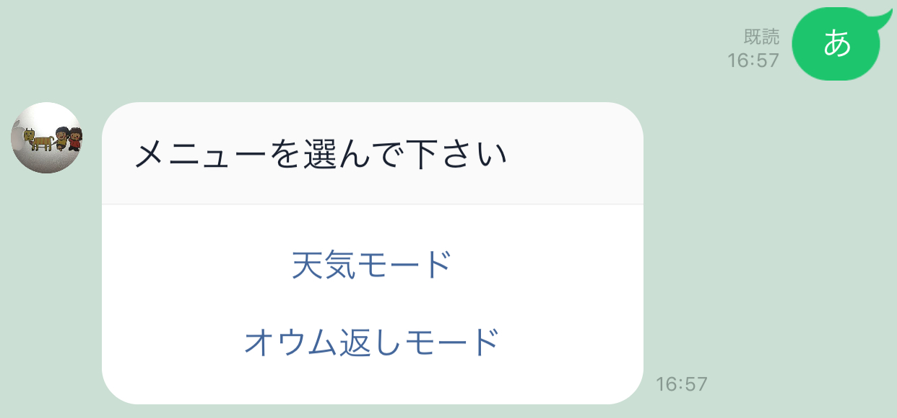
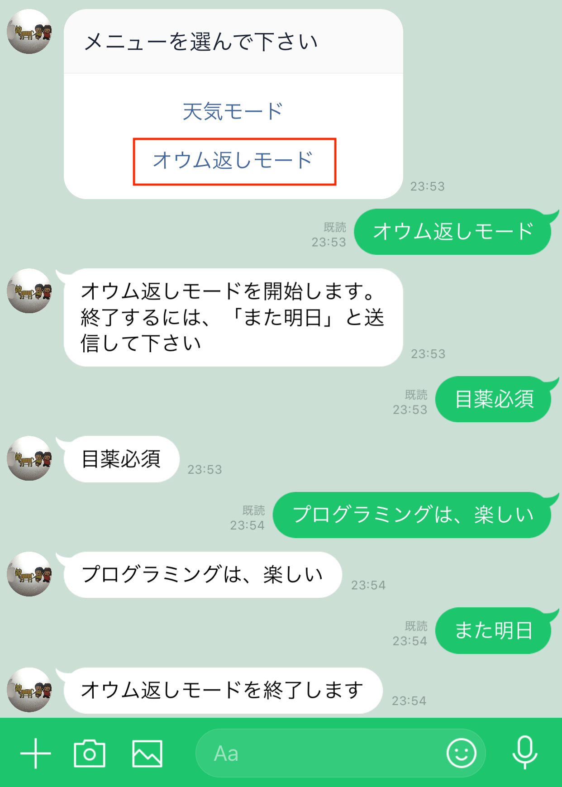

# **rubyでline-bot**
line-botで、「天気モード：天気を知ること」と「オウム返しモード：オウム返し体験」が出来ます。

1.[LINE-ID](#LINE-ID)  
2.[MENU](#MENU)  
3.[天気モード](#天気モード)  
4.[オウム返しモード](#オウム返しモード)  
5.[注意点](#注意点)  
6.[今後の展開](#今後の展開)  
7.[製作者](#製作者)

### *LINE-ID*
---
　LINEアプリの友達検索で「@310ozlsm」と検索するか、下記のQRコードを読み込むことで、利用できます。
* *画面*

 

### *MENU*
---
　どんなメッセージでも良いので送信をすると、MENU画面が表示されます。使用したいモードをタップして下さい。
　また、スタンプを送信すると各モードから強制的に抜けることができます。
* *画面*

 

### *天気モード*
---
　MENU画面の「天気モード」をタップすると、開始されます。日本各地の今日と明日の天気を表示できます。
* *画面*

 

 

### *オウム返しモード*
---
　MENU画面の「オウム返しモード」をタップすると、開始されます。LINE-BOTがオウム返しします。終了するには、「また明日」とメッセージを送信して下さい。
* *画面*

 

### *注意点*
---
　スマートフォンのみ対応です。LINEアプリの仕様のため。
 

### *開発環境*
---
* Ruby 2.5.1
* LINE-BOT
* LINE Developer
* Github
* デプロイ HEROKU

 

### *今後の展開*
---
- [ ] 天気モードで一度地域登録すると、2回目以降は地域選択不要
- [ ] 明日、雨が降る場合、事前通知

などを実装していきたいと思います。

 

### *製作者*
---
onikunai  
Github: https://github.com/onikunai  
Twitter: @onikunai1  

